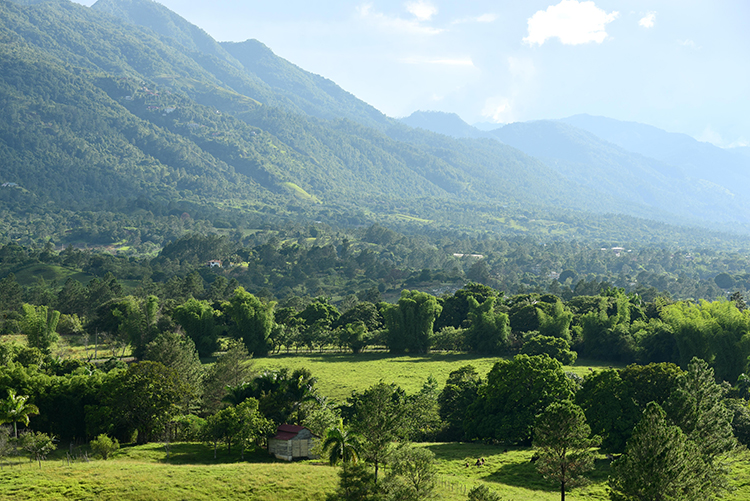
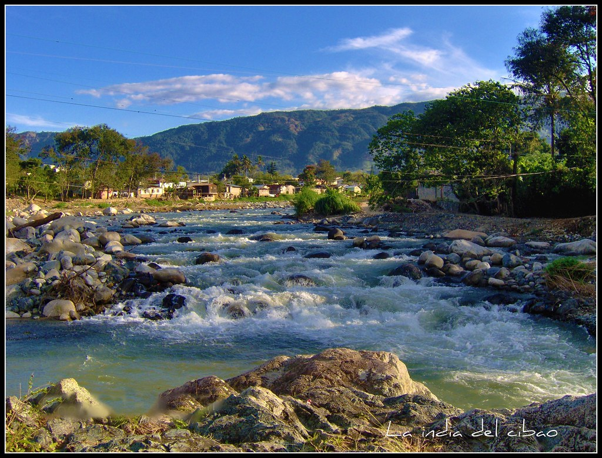
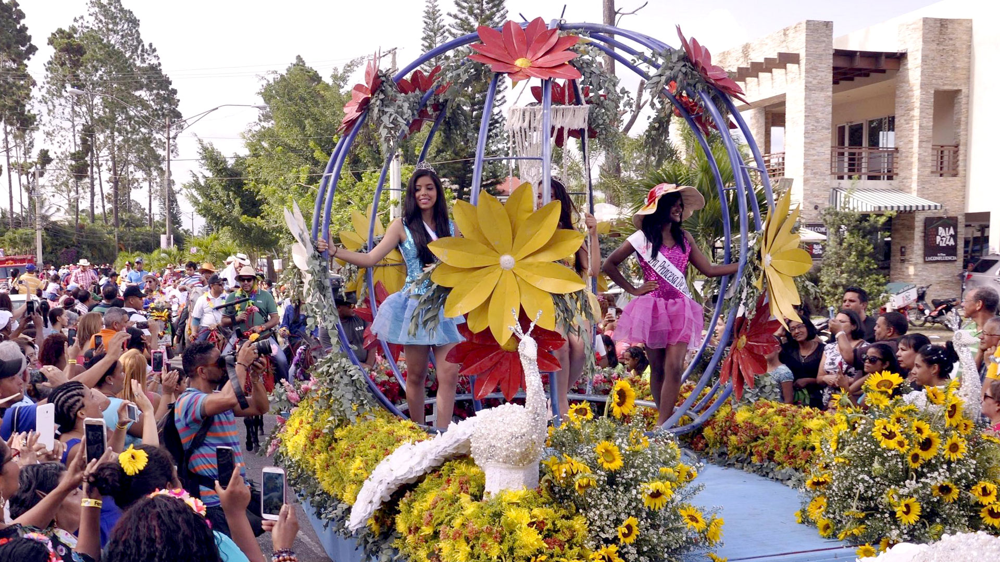
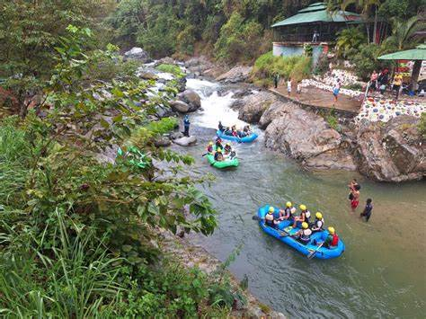
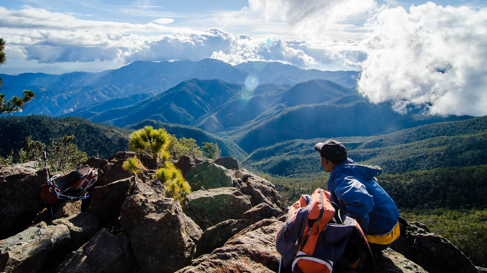
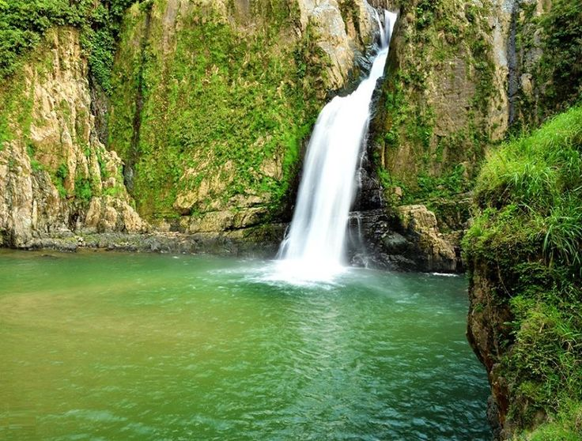
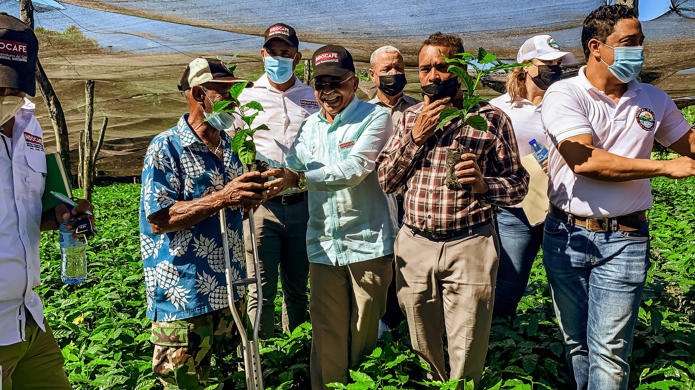

# Jarabacoa: La Ciudad de la Eterna Primavera

**Jarabacoa**, conocida como "La Ciudad de la Eterna Primavera", es un destino turístico, ecológico y cultural ubicado en el corazón de la República Dominicana. Este municipio, parte de la provincia de La Vega, se distingue por su clima fresco, paisajes montañosos, ríos caudalosos y su rica biodiversidad.

---

## Historia de Jarabacoa

El nombre "Jarabacoa" proviene del idioma taíno y significa "Lugar de aguas". Se cree que los taínos, los primeros habitantes de la isla, se asentaron en esta región debido a su abundancia de recursos naturales.  

La historia moderna de Jarabacoa comienza en el siglo XIX con la llegada de familias españolas que se establecieron en sus fértiles tierras. A lo largo del tiempo, la región ha evolucionado, pasando de ser un pueblo agrícola a convertirse en uno de los principales destinos turísticos y de descanso en el país.  

---

## Geografía y Clima

Jarabacoa está situado en el valle de La Vega Real, rodeado por montañas de la **Cordillera Central**, la cadena montañosa más alta del Caribe. Su altitud promedio es de **529 metros sobre el nivel del mar**, lo que le otorga un clima templado durante todo el año, con temperaturas que oscilan entre los 16 °C y 22 °C.

### Ríos Principales
- **Río Yaque del Norte**: El río más largo de la República Dominicana, ideal para actividades como rafting.  
- **Río Jimenoa**: Conocido por sus cascadas, es una joya natural.  
- **Río Baiguate**: Perfecto para actividades recreativas y turismo ecológico.  

---

## Habitantes y Cultura

Según el censo más reciente, Jarabacoa cuenta con aproximadamente **70,000 habitantes**, muchos de los cuales se dedican a la agricultura, el turismo y el comercio. La gente de Jarabacoa es conocida por su hospitalidad, amor por la naturaleza y compromiso con la sostenibilidad.  

La cultura jarabacoense se enriquece con sus festividades, como el **Festival de las Flores**, que celebra la biodiversidad de la región, y las tradiciones religiosas de Semana Santa.  

### Gastronomía
- **Chivo liniero**: Plato típico cocinado con hierbas locales.  
- **Dulces de leche y frutas**: Una delicia artesanal muy buscada.  

---

## Turismo en Jarabacoa

Jarabacoa es uno de los destinos turísticos más visitados de la República Dominicana, ofreciendo una combinación única de aventura, relajación y naturaleza.

### Actividades Populares
1. **Rafting en el Río Yaque del Norte**: Una experiencia emocionante para los amantes de los deportes extremos.  
     

2. **Senderismo y Montañismo**: Rutas como la del Pico Duarte, el punto más alto del Caribe con 3,098 metros, atraen a excursionistas de todo el mundo.  
     

3. **Cascadas**:  
   - **Salto de Jimenoa I y II**: Dos cascadas impresionantes rodeadas de una exuberante vegetación.  
   - **Salto de Baiguate**: Famoso por su fácil acceso y belleza escénica.  
     

4. **Parapente**: Los vientos constantes y las montañas hacen de Jarabacoa un lugar ideal para esta actividad.  

---

## Agricultura y Economía

Jarabacoa es un importante productor de café, flores y vegetales en el país. La calidad de su café, cultivado en altura, es reconocida tanto a nivel nacional como internacional. Además, la floricultura ha ganado protagonismo, exportando flores exóticas a diversos mercados.  

### Productos Típicos
- **Café orgánico**: Cultivado de manera sostenible.  
- **Orquídeas y otras flores tropicales**.  

---

## Lugares Emblemáticos

### La Confluencia
Un lugar perfecto para picnics y paseos familiares, donde los ríos Jimenoa y Yaque del Norte se encuentran.  

### Rancho Baiguate
Ofrece actividades como paseos a caballo, rafting y excursiones guiadas.  

---

## Educación y Desarrollo Sostenible

Jarabacoa también es un centro educativo, con instituciones que se enfocan en el desarrollo sostenible. Destaca el trabajo de ONGs que promueven la conservación de los recursos naturales y el ecoturismo responsable.  

---

## Conclusión

Jarabacoa es mucho más que un destino turístico; es un lugar donde la naturaleza, la aventura y la cultura se combinan para ofrecer una experiencia inolvidable. Su clima fresco, paisajes majestuosos y el calor humano de sus habitantes lo convierten en un lugar único en la República Dominicana.  

---
