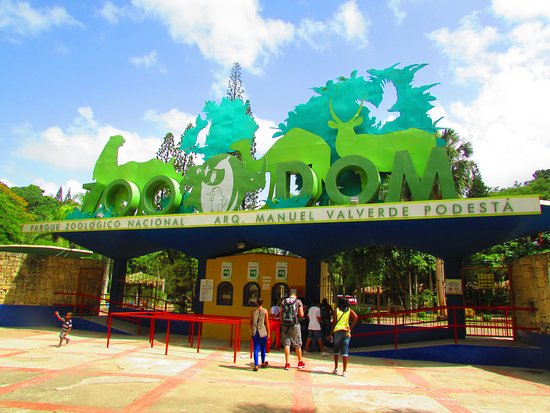
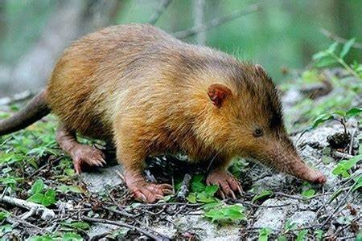
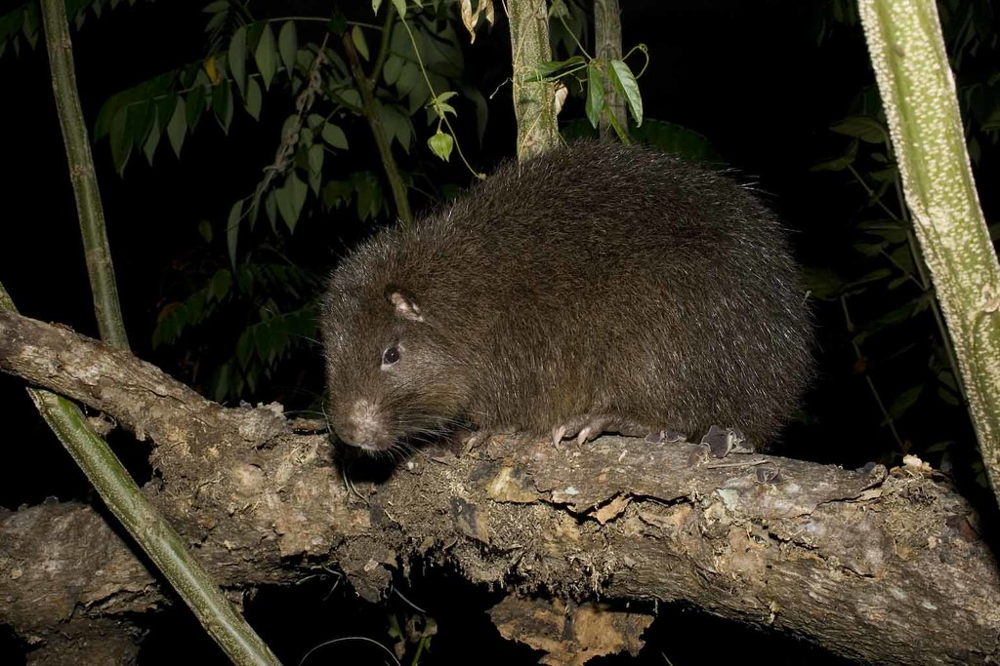
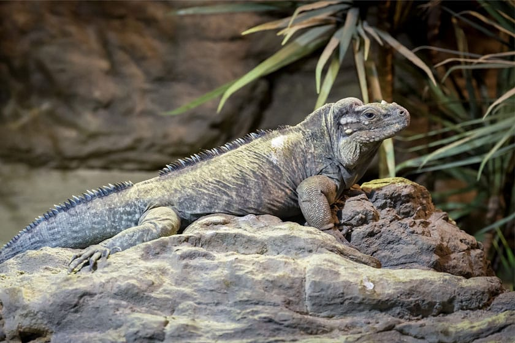
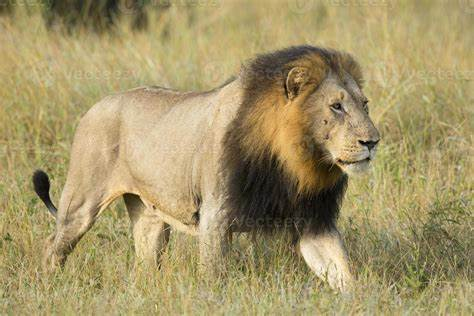
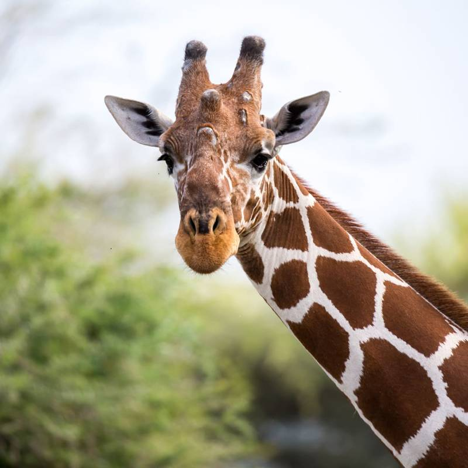
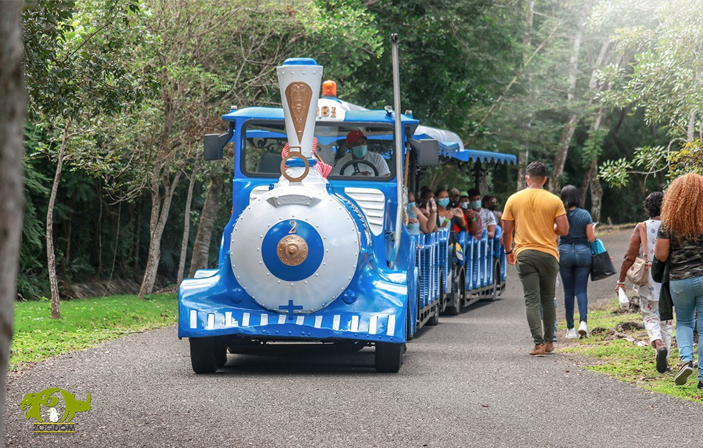
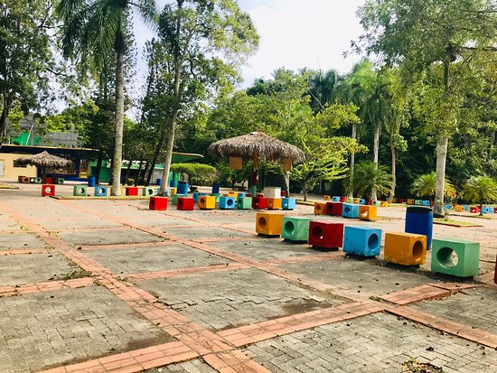

# Zoológico Nacional de Santo Domingo

El **Zoológico Nacional de Santo Domingo**, oficialmente conocido como Zoológico Nacional Dr. Rafael M. Moscoso, es una de las principales atracciones turísticas y educativas de la República Dominicana. Fundado en 1975, este parque tiene como misión la conservación, educación y recreación, proporcionando un espacio seguro para la preservación de diversas especies animales y la concienciación ambiental.

---

## Historia y Fundamento

El Zoológico Nacional fue inaugurado el **5 de julio de 1975**, bajo la administración del entonces presidente Joaquín Balaguer, con el objetivo de crear un espacio donde las familias dominicanas pudieran disfrutar de la naturaleza mientras aprendían sobre fauna nativa y exótica. Fue nombrado en honor al botánico dominicano **Dr. Rafael María Moscoso**, autor del primer catálogo de flora dominicana.  

Este zoológico se destaca por su enfoque en el bienestar animal, manteniendo a los animales en amplios espacios que imitan sus hábitats naturales. Su diseño es único, pues busca reducir las barreras físicas entre los visitantes y los animales sin comprometer la seguridad.

---

## Ubicación y Extensión

El Zoológico Nacional se encuentra en el municipio Santo Domingo Norte, a pocos kilómetros del centro de la ciudad de Santo Domingo.  

### Características principales:
- **Área total**: 1.25 kilómetros cuadrados (125 hectáreas).
- **Vegetación predominante**: Bosques secos subtropicales y flora endémica de la isla.
- **Infraestructura**: Caminos, miradores, áreas de picnic y un tren turístico que recorre el parque.  

---

## Especies y Exhibiciones

El Zoológico Nacional alberga una amplia variedad de animales, tanto nativos como exóticos. Actualmente, cuenta con más de **500 individuos de diferentes especies**, distribuidos en áreas temáticas.  

### Animales Nativos

1. **Solenodonte** (*Solenodon paradoxus*): Mamífero insectívoro único de la isla.  
     

2. **Hutía** (*Plagiodontia aedium*): Un roedor endémico que está en peligro de extinción.  
     

3. **Iguana Rinoceronte** (*Cyclura cornuta*): Una de las especies más emblemáticas del parque.  
     

### Animales Exóticos

1. **León africano** (*Panthera leo*): Uno de los mayores atractivos del zoológico, ubicado en un amplio recinto que simula la sabana africana.  
     

2. **Elefante asiático** (*Elephas maximus*): Este gigante de la selva cuenta con un espacio dedicado a recrear su hábitat natural.  
     

3. **Jirafa** (*Giraffa camelopardalis*): Una de las favoritas del público, especialmente de los niños.  
     

---

## Actividades y Experiencias

El zoológico ofrece una experiencia educativa y recreativa única para sus visitantes:  

### Recorridos Guiados

Los visitantes pueden optar por recorridos guiados con expertos en biología y ecología que explican la importancia de las especies y su conservación.  

### Tren Turístico

Un tren turístico permite recorrer las principales áreas del zoológico, ideal para familias con niños pequeños o personas mayores.  
  

### Programas Educativos

El parque organiza charlas y talleres dirigidos a estudiantes y público en general para fomentar el respeto por la naturaleza y la importancia de la biodiversidad.  

### Área Infantil

Cuenta con un área interactiva donde los más pequeños pueden aprender sobre los animales de granja y participar en actividades como alimentar cabras y gallinas.  
  

---

## Importancia para la Conservación

El Zoológico Nacional desempeña un papel crucial en la conservación de especies en peligro de extinción, especialmente aquellas nativas de la isla. Colabora con organizaciones internacionales y locales en programas de reproducción y reintroducción de especies a su hábitat natural.  

Algunas iniciativas destacadas incluyen:  
- **Proyecto de Conservación del Solenodonte y la Hutía**.  
- **Programa de Protección de la Iguana Rinoceronte**.  

---

## Servicios para Visitantes

Para garantizar una experiencia cómoda, el Zoológico Nacional cuenta con:  
- **Áreas de descanso**: Bancos y miradores en puntos estratégicos.  
- **Cafetería y kioskos**: Ofrecen comida rápida y bebidas.  
- **Tienda de souvenirs**: Productos relacionados con la fauna del zoológico.  
- **Estacionamiento amplio**: Con capacidad para vehículos y autobuses escolares.  

  

---

## Información General

- **Horario**: Martes a domingo, de 9:00 a.m. a 5:00 p.m.  
- **Precios de Entrada**:  
  - Adultos: RD$150  
  - Niños: RD$100  
  - Estudiantes (en grupo): RD$50 por persona  

- **Dirección**: Avenida Los Próceres, Santo Domingo Norte, República Dominicana.  
- **Teléfono**: +1 (809) 567-1717  
- **Página Web**: [Zoológico Nacional](http://www.zoodom.gov.do)  

---

## Conclusión

El Zoológico Nacional de Santo Domingo es un espacio emblemático que combina educación, conservación y recreación. Su misión de proteger la fauna y flora nativa, mientras promueve la conciencia ambiental, lo convierte en un destino ideal para todas las edades. Ya sea explorando sus amplias áreas verdes, aprendiendo sobre animales en peligro de extinción o simplemente disfrutando de un día en familia, el Zoológico Nacional es un lugar imprescindible en la República Dominicana.  

¡Anímate a visitarlo y descubre el maravilloso mundo animal que alberga este tesoro natural!
