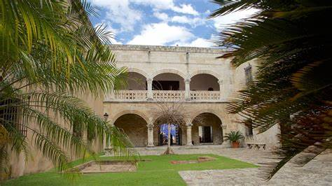
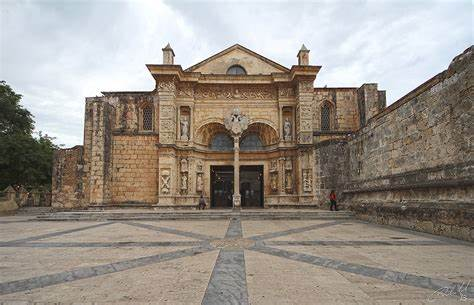
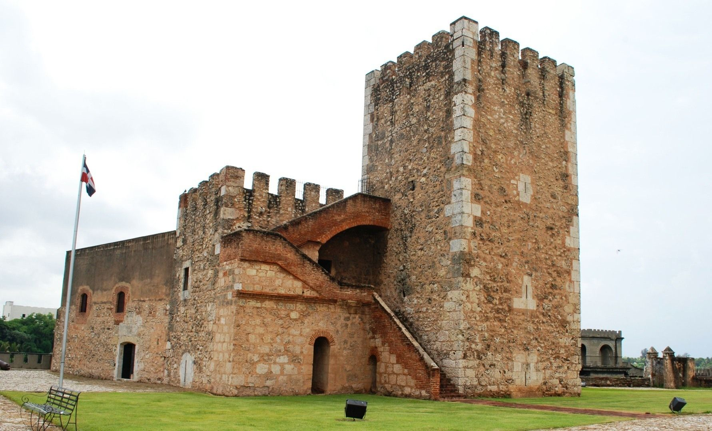
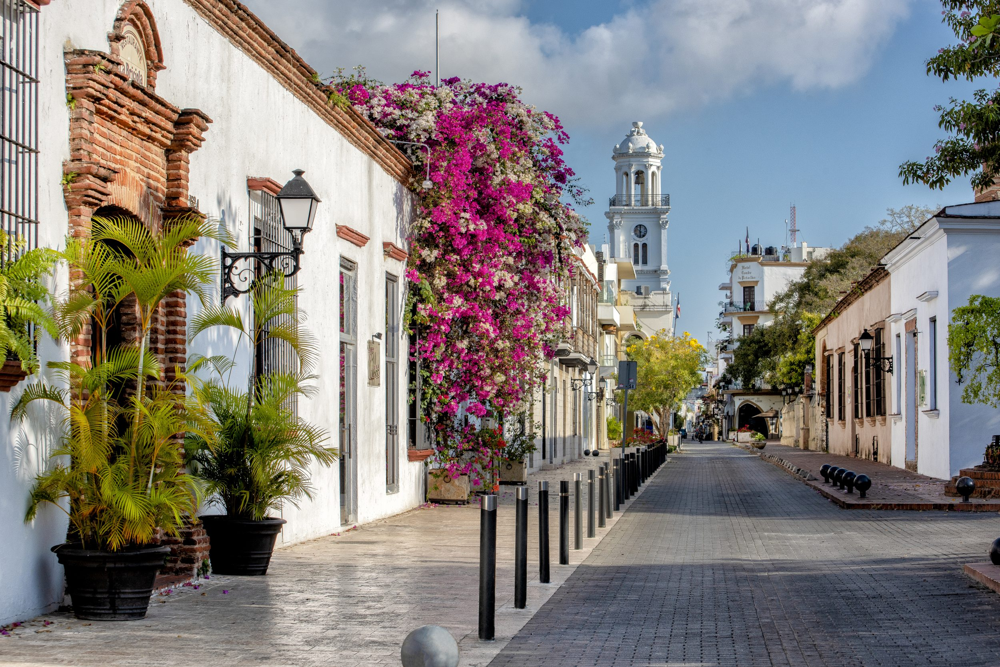
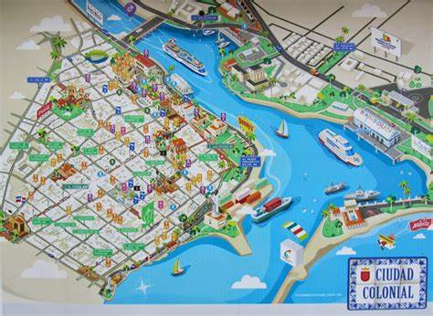

# Ciudad Colonial de Santo Domingo

La **Ciudad Colonial de Santo Domingo** (también llamada Zona Colonial) es el núcleo urbano más antiguo de la ciudad de Santo Domingo, capital de la República Dominicana. Fue el **primer asentamiento europeo permanente en América**, fundada en 1502 por los conquistadores españoles.  

---

## Historia y Atracciones Turísticas

Esta área cuenta con edificios coloniales y calles adoquinadas de gran atractivo turístico. Algunos lugares emblemáticos incluyen:  

- **Alcázar de Colón**: Residencia de Diego Colón, hijo de Cristóbal Colón.  
   

- **Museo de las Casas Reales**: Exhibe la historia colonial del Caribe.  
  

- **Catedral Primada de América**: La primera catedral del continente americano.  
  

- **Fortaleza Ozama**: Una fortaleza colonial histórica.  
  

Además, las **Calle El Conde** y la **Calle Las Damas** son las principales vías donde se concentran tiendas, restaurantes y hoteles históricos, como:  

- **Hotel Conde de Peñalba**: Perfecto para disfrutar de la vista a la Catedral Primada.  
- **Sofitel Nicolás de Ovando**: Este hotel combina el lujo moderno con el encanto histórico, ubicado en la antigua residencia de Nicolás de Ovando.  

---

## Reconocimientos y Patrimonio

El 8 de diciembre de 1990, la Ciudad Colonial fue declarada **Patrimonio de la Humanidad por la UNESCO**, bajo el nombre de **Ciudad colonial de Santo Domingo**. Este reconocimiento internacional destaca su invaluable contribución a la historia y cultura del continente americano.  

Con un área de 93 hectáreas, la Ciudad Colonial conserva su legado histórico a través de proyectos de restauración y preservación que permiten a los visitantes experimentar cómo era la vida en la época colonial.  

  

---

## Extensión y Calles Principales

La Ciudad Colonial se extiende desde:  

- **Norte**: Avenida George Washington  
- **Este**: Calle Palo Hincado hasta su esquina con la Avenida Mella  
- **Sur**: Avenida Mella  
- **Oeste**: Avenida Francisco Alberto Caamaño  

### Calles principales:
- **Calle Las Mercedes**: Conocida por su ambiente bohemio y cultural.  
- **Calle El Conde**: Ideal para compras y paseos.  
- **Calle Las Damas**: La calle más antigua del Nuevo Mundo, llena de historia y leyendas.  

  

---

## Vida Urbana y Eventos

La Ciudad Colonial no solo es un destino turístico, sino también un lugar vibrante donde se celebran eventos culturales y artísticos. Durante el año, se organizan actividades como:  

- **Noche Larga de los Museos**: Una jornada en la que los museos abren sus puertas gratuitamente.  
- **Festival de Música Colonial**: Un evento que resalta los sonidos clásicos y tradicionales de la región.  
- **Mercados Artesanales**: Exposición de arte y productos locales en las plazas principales.  

Los cafés y restaurantes en las plazas, como la **Plaza España** y la **Plaza Colón**, ofrecen un ambiente relajado donde se puede disfrutar de la gastronomía dominicana.  

---

## Conclusión

La Ciudad Colonial de Santo Domingo no solo representa el origen histórico de la ciudad, sino que también es un testimonio vivo de la herencia cultural y arquitectónica del continente americano. Este destino combina historia, arte, gastronomía y una vibrante vida moderna, convirtiéndolo en un lugar único. Tanto para turistas como para locales, explorar sus calles y descubrir sus secretos es una experiencia inolvidable.  